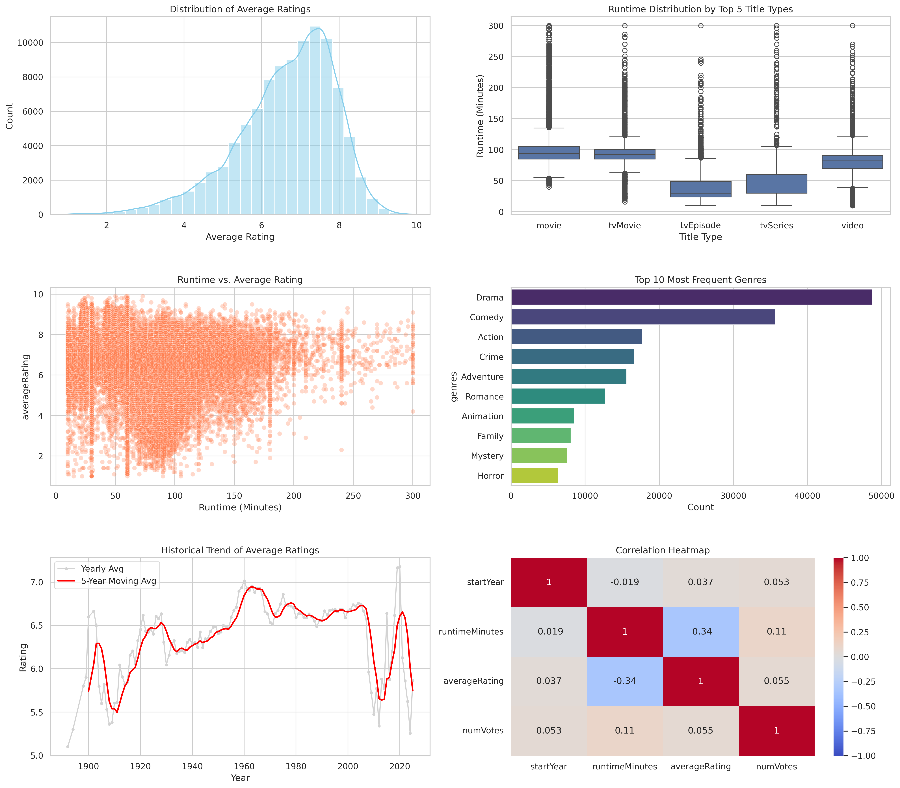
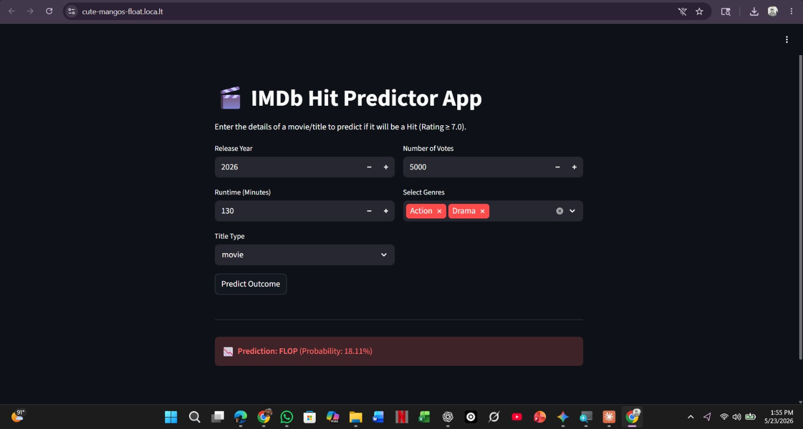

# 🎬 Predicting Movie Success: My BDA Final Semester Project

Hi there! I'm Muhhammad Dawood Hayat, and welcome to my final semester Business Data Analytics (BDA) capstone project for COMSATS University Islamabad. 

If you are reading this, you are looking at the culmination of months of hard work. Between the late-night coding sessions, wrestling with massive datasets that pushed my hardware to the limit, and figuring out how to actually deploy a machine learning web app from scratch—this project has been an absolute rollercoaster. It challenged everything I've learned, but it works beautifully, and I am incredibly proud to share it with you.

I set out to answer a question that has always fascinated me: **Can we predict if a movie will be a hit or a massive flop based purely on its core data?** Let me walk you through exactly how I built the answer.

---

## 🧠 The Data Journey

This project wasn't just about throwing numbers into an algorithm to pass a class. It was a complete, start-to-finish data engineering pipeline.

1. **Taming the Beast:** I started with hundreds of thousands of raw records straight from the official IMDb database. The data was incredibly messy. I had to clean out missing values, filter out extreme outliers (because nobody is watching a 10-hour movie!), and format everything so my models could actually understand it.
2. **Training the Machine:** I built two distinct machine learning pipelines using Scikit-Learn. 
   * **Linear Regression:** To predict a movie's exact IMDb rating.
   * **Logistic Regression:** To classify whether a movie is officially a "Hit" (a rating of 7.0 or higher).

---

## 📊 What the Data Told Me (Exploratory Data Analysis)

Before making predictions, I needed to understand the story hidden inside the data. 

*Through my analysis, I uncovered several fascinating truths about the film industry:*
* **The Golden Runtime:** Movies have a very clear "sweet spot" for runtime when it comes to securing a high rating from audiences.
* **Documentary Dominance:** Documentaries consistently score higher on average compared to traditional feature films.
* **Generational Shifts:** The average rating of movies actually fluctuates depending on the decade, highlighting how audience standards change over time.

---

## 🕹️ Bringing it to Life: The Web App

I didn't want my machine learning models just sitting inside a Jupyter notebook where nobody could use them. I wanted this to be a real, interactive tool. So, I built a fully functional web application using Streamlit. 

You can literally type in your own imaginary movie details—choose the runtime, release year, and genres—and see if my model predicts it will survive the box office!

**Want to try the app on your own computer?**
1. Clone this repository to your laptop.
2. Open your terminal or command prompt inside the folder.
3. Type this exact command and hit enter: `streamlit run app.py`
4. A browser window will pop up. Have fun testing it out!

---

## ⚠️ How to Grade or Run My Code (Please Read!)

There is one catch: The raw IMDb data files are absolutely massive. They completely break GitHub's strict file size limits, so I couldn't upload them directly to this repository. 

**If you want to run my `.ipynb` notebook to see the code in action, here is exactly what you need to do:**
1. Go to the official [IMDb Datasets page](https://datasets.imdbws.com/).
2. Download these two specific compressed files: `title.basics.tsv.gz` and `title.ratings.tsv.gz`.
3. Extract them on your computer.
4. Rename them to `title.basics.tsv_2` and `title.ratings.tsv_2` (or simply update the file names in the very first block of my code).
5. Put them in the exact same folder as my notebook, or upload them to your Google Colab workspace.
6. Open my notebook, hit **Run All**, and watch the magic happen!

---

## ❤️ Final Thoughts

Finishing this capstone feels like closing a massive, transformative chapter of my academic life. Data analytics isn't just about math, spreadsheets, or code anymore; I have learned that it is really about finding the human stories hidden inside millions of rows of text. 

Thank you so much for taking the time to visit my repository and look at my work. If you have any feedback, questions, or just want to chat about the project, I would love to hear from you!
